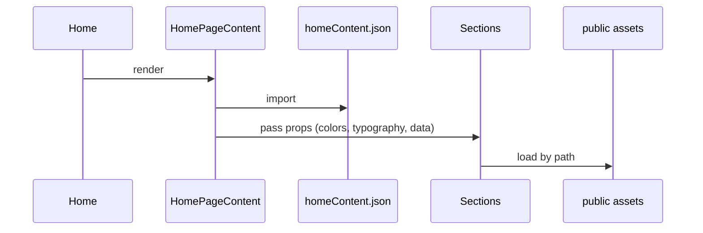

## Scope
- Produce a single, developer-friendly workflow document covering architecture, data flow, file structure, and step-by-step processes for adding/modifying projects.
- Include visual diagrams for page rendering, data loading, and component hierarchy (Mermaid).
- Provide code path references and examples grounded in this repository.

## Deliverables
1. Frontend Structure
- Layout components: `Navbar1` (`components/navbar1.tsx`), `ContactSection` (`app/components/ContactSection.tsx`), `Footer` (`app/components/home/Footer.tsx`).
- Main pages: `app/page.tsx` (Home), `app/ml/[slug]/page.tsx` (ML), `app/product-design/[slug]/page.tsx` (PD).
- Section components organization: `app/components/projects/ml-sections/*` and `app/components/projects/pd-sections/*`.

2. Data Management
- Primary data sources: `app/data/homeContent.json`, `app/data/mlProjects.ts`, `app/data/productDesignProjects.ts`.
- Rules: all text, image paths (under `public/`), and SVG references live in these data files; UI components receive props only.
- Utility functions reference: `app/utils/projectUtils.ts` for retrieval helpers.

3. Project Creation Process
- Create section component under the relevant folder (`pd-sections`/`ml-sections`).
- Add a new project entry with `slug` in the corresponding data file.
- Update `homeContent.json` preview lists to surface the project on Home.
- Update dynamic route switch in `app/ml/[slug]/page.tsx` or `app/product-design/[slug]/page.tsx` to render the new section component.
- Assets: store in `public/` and reference via root-relative paths.
- Provide a fully worked example (ML and PD) with code path references.

4. Style Guidelines
- Spacing, heading sizes, color scheme, component layouts: derive from `homeContent.json` (`colors`, `typography`) and shared UI (`app/components/ui/Layout.tsx`, `Typography.tsx`).
- Do not hardcode styles in project components; consume passed props or shared tokens.

5. Improvement Process
- Analyze current sections and dependencies before changes.
- Respect data-driven architecture: never hardcode text or image paths.
- Plan modifications to avoid breaking dynamic routes (`dynamicParams=false` requires slugs to exist in data).

6. Visual Diagrams (Mermaid)
- Page rendering flow from request → layout → page → section components.
- Data loading sequence for Home and project pages.
- Component hierarchy under `AppLayout` shell.

7. File Structure Overview
- Summarize key directories (`app/`, `app/components/home/`, `app/components/projects/*`, `app/data/`, `app/utils/`, `public/`, `types/`).
- Include brief descriptions and responsibilities.

8. Code References
- Inline references using `file_path:line_number` to key functions like `generateStaticParams` and `getProjectBySlug`.

## Example Diagram Stubs (to be finalized)
- Rendering Flow:
```mermaid
flowchart TD
A[Request /ml/:slug] --> B[RootLayout app/layout.tsx]
B --> C[AppLayout app/components/AppLayout.tsx]
C --> D[ML Page app/ml/[slug]/page.tsx]
D --> E{switch slug}
E --> F[RagEvaluationSystem]
E --> G[FraudDetectionSystem]
E --> H[RealTimeMeetingAgent]
C --> I[ContactSection]
C --> J[Footer]
```
- Data Loading (Home):


## Writing Style
- Clear bullets, minimal formatting, consistent monospace for file paths and identifiers.
- Educational tone with concise rationale and explicit do/don’t.

## Next Step
- Upon confirmation, I will deliver the full documentation with diagrams, examples, and code references aligned to the above plan.