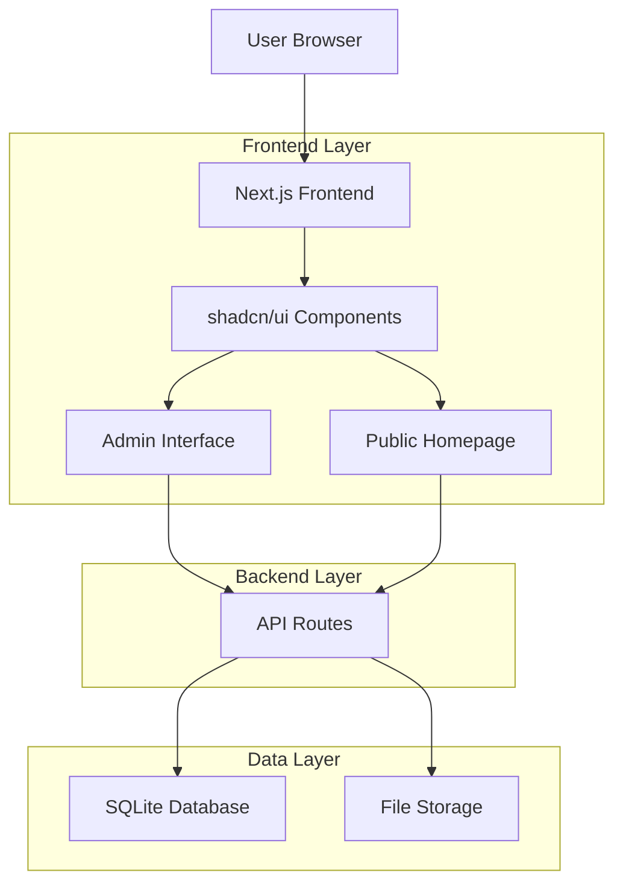
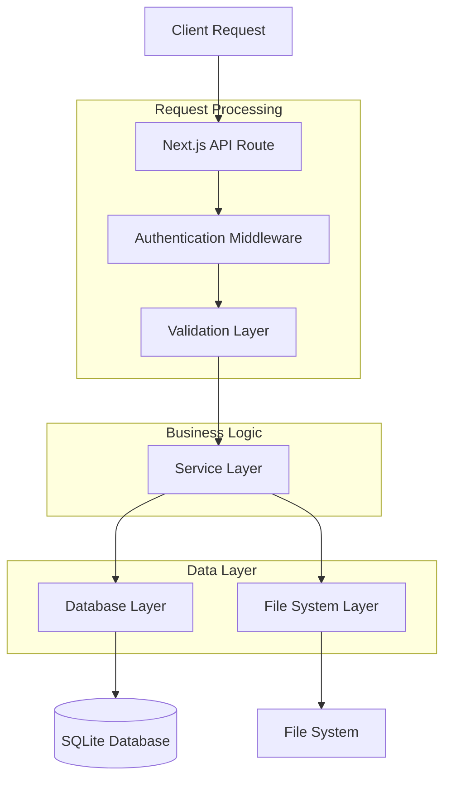
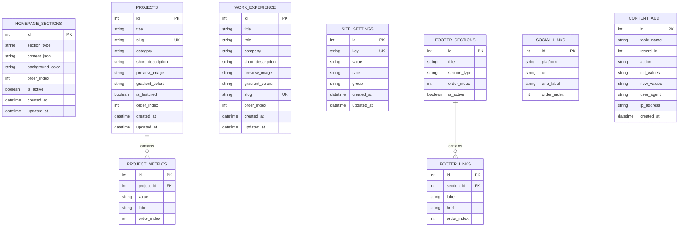

# Technical Architecture: SQLite Migration with shadcn/ui Components

## 1. Architecture Design



## 2. Technology Description

### Core Stack
- **Frontend**: Next.js 14 + React 18 + TypeScript
- **UI Components**: shadcn/ui component library
- **Styling**: Tailwind CSS + Custom design tokens
- **Database**: SQLite with better-sqlite3
- **File Storage**: Local filesystem with Sharp image processing
- **Validation**: Zod schemas for type safety
- **Forms**: React Hook Form with Zod resolvers
- **State Management**: React Context + SWR for data fetching

### Required Dependencies
```json
{
  "dependencies": {
    "@hookform/resolvers": "^3.3.4",
    "@radix-ui/react-*": "^1.0.0",
    "@tanstack/react-table": "^8.11.0",
    "better-sqlite3": "^9.2.2",
    "class-variance-authority": "^0.7.0",
    "clsx": "^2.1.0",
    "lucide-react": "^0.303.0",
    "next": "^14.0.4",
    "react": "^18.2.0",
    "react-colorful": "^5.6.1",
    "react-dom": "^18.2.0",
    "react-hook-form": "^7.50.1",
    "sharp": "^0.33.2",
    "sonner": "^1.3.1",
    "swr": "^2.2.4",
    "tailwind-merge": "^2.2.0",
    "zod": "^3.22.4"
  },
  "devDependencies": {
    "@types/better-sqlite3": "^7.6.8",
    "@types/node": "^20.10.5",
    "@types/react": "^18.2.45",
    "@types/react-dom": "^18.2.18",
    "eslint": "^8.56.0",
    "typescript": "^5.3.3"
  }
}
```

## 3. Route Definitions

### Public Routes
| Route | Purpose | Components Used |
|-------|---------|-----------------|
| `/` | Homepage with dynamic content | Card, Button, Badge, Avatar |
| `/ml/[slug]` | ML project detail pages | Card, Tabs, Table, Badge |
| `/product-design/[slug]` | PD project detail pages | Card, ImageGallery, Typography |

### Admin Routes
| Route | Purpose | shadcn Components |
|-------|---------|-------------------|
| `/admin/login` | Admin authentication | Card, Form, Input, Button, Label |
| `/admin/dashboard` | Main admin dashboard | Card, Tabs, DataTable, Badge |
| `/admin/homepage` | Homepage content editor | Card, Tabs, Form, Input, Textarea |
| `/admin/homepage/hero` | Hero section editor | Card, Form, Input, Textarea, Sheet |
| `/admin/homepage/services` | Services management | Card, Collapsible, Input, Button |
| `/admin/homepage/features` | Features editor | Card, Collapsible, Input, Select |
| `/admin/homepage/about` | About section editor | Card, Form, Input, Textarea, Table |
| `/admin/homepage/contact` | Contact settings | Card, Form, Input, Textarea |
| `/admin/projects` | Project management | Card, DataTable, Button, Badge |
| `/admin/projects/[id]` | Project editor | Card, Form, Input, Textarea, Sheet |
| `/admin/settings/colors` | Color scheme editor | Card, Input, Popover, Button |
| `/admin/settings/general` | General settings | Card, Form, Input, Switch, Select |

### API Routes
| Route | Method | Purpose |
|-------|--------|---------|
| `/api/homepage` | GET | Fetch homepage content |
| `/api/homepage/sections` | POST | Create new section |
| `/api/homepage/sections/[id]` | GET/PUT/DELETE | Section CRUD operations |
| `/api/projects` | GET/POST | Project list and creation |
| `/api/projects/[id]` | GET/PUT/DELETE | Project CRUD operations |
| `/api/settings` | GET | Fetch all settings |
| `/api/settings/[key]` | GET/PUT | Individual setting operations |
| `/api/admin/login` | POST | Admin authentication |
| `/api/admin/logout` | POST | Admin logout |
| `/api/admin/auth/check` | GET | Check auth status |
| `/api/upload/image` | POST | Image upload handler |
| `/api/health` | GET | System health check |

## 4. API Definitions

### Core API Types

```typescript
// types/api.ts
export interface ApiResponse<T> {
  success: boolean;
  data?: T;
  error?: string;
  timestamp: string;
}

export interface HomepageSection {
  id: number;
  section_type: 'hero' | 'services' | 'features' | 'about' | 'contact';
  content_json: string;
  background_color?: string;
  order_index: number;
  is_active: boolean;
  created_at: string;
  updated_at: string;
}

export interface Project {
  id: number;
  title: string;
  slug: string;
  category: 'ml' | 'pd';
  short_description: string;
  preview_image: string;
  gradient_colors: string[];
  is_featured: boolean;
  order_index: number;
  created_at: string;
  updated_at: string;
}

export interface SiteSetting {
  id: number;
  key: string;
  value: string;
  type: 'string' | 'json' | 'color' | 'number' | 'boolean';
  group: 'colors' | 'general' | 'appearance';
  created_at: string;
  updated_at: string;
}
```

### API Request/Response Examples

**GET /api/homepage**
```typescript
// Request
// No parameters required

// Response
{
  "success": true,
  "data": {
    "sections": [
      {
        "id": 1,
        "section_type": "hero",
        "content_json": "{\"badge\":\"HUMAN & AI\",\"title\":\"Smart systems...\"}",
        "background_color": "#f7f4ed",
        "order_index": 0,
        "is_active": true,
        "created_at": "2025-01-01T00:00:00Z",
        "updated_at": "2025-01-01T00:00:00Z"
      }
    ],
    "settings": {
      "colors": {
        "primary": "#f0633f",
        "secondary": "#191818"
      }
    }
  },
  "timestamp": "2025-01-01T00:00:00Z"
}
```

**PUT /api/homepage/sections/1**
```typescript
// Request Body
{
  "section_type": "hero",
  "content_json": "{\"badge\":\"UPDATED BADGE\",\"title\":\"Updated title...\"}",
  "background_color": "#f7f4ed",
  "order_index": 0,
  "is_active": true
}

// Response
{
  "success": true,
  "data": {
    "id": 1,
    "section_type": "hero",
    "content_json": "{\"badge\":\"UPDATED BADGE\",\"title\":\"Updated title...\"}",
    "background_color": "#f7f4ed",
    "order_index": 0,
    "is_active": true,
    "updated_at": "2025-01-01T12:00:00Z"
  },
  "timestamp": "2025-01-01T12:00:00Z"
}
```

## 5. Server Architecture Diagram



### Service Layer Architecture

```typescript
// lib/services/homepageService.ts
import { db } from '@/lib/db';
import { HomepageSection, SiteSetting } from '@/types/api';

export class HomepageService {
  async getHomepageContent(): Promise<{
    sections: HomepageSection[];
    settings: Record<string, any>;
  }> {
    const sections = db.prepare('SELECT * FROM homepage_sections WHERE is_active = 1 ORDER BY order_index').all();
    const settings = this.groupSettingsByCategory(
      db.prepare('SELECT * FROM site_settings').all()
    );
    
    return { sections, settings };
  }

  async updateSection(id: number, data: Partial<HomepageSection>): Promise<HomepageSection> {
    const stmt = db.prepare(`
      UPDATE homepage_sections 
      SET content_json = ?, background_color = ?, order_index = ?, is_active = ?, updated_at = CURRENT_TIMESTAMP
      WHERE id = ?
      RETURNING *
    `);
    
    return stmt.get(
      data.content_json,
      data.background_color,
      data.order_index,
      data.is_active,
      id
    );
  }

  private groupSettingsByCategory(settings: SiteSetting[]): Record<string, any> {
    return settings.reduce((acc, setting) => {
      const { group, key, value, type } = setting;
      if (!acc[group]) acc[group] = {};
      
      acc[group][key] = this.parseSettingValue(value, type);
      return acc;
    }, {} as Record<string, any>);
  }

  private parseSettingValue(value: string, type: string): any {
    switch (type) {
      case 'json':
        return JSON.parse(value);
      case 'number':
        return Number(value);
      case 'boolean':
        return value === 'true';
      case 'color':
      case 'string':
      default:
        return value;
    }
  }
}
```

## 6. Data Model

### Entity Relationship Diagram



### Data Definition Language (DDL)

```sql
-- Site settings table
CREATE TABLE site_settings (
    id INTEGER PRIMARY KEY AUTOINCREMENT,
    key TEXT UNIQUE NOT NULL,
    value TEXT NOT NULL,
    type TEXT DEFAULT 'string' CHECK (type IN ('string', 'json', 'color', 'number', 'boolean')),
    group TEXT DEFAULT 'general' CHECK (group IN ('colors', 'general', 'appearance')),
    created_at DATETIME DEFAULT CURRENT_TIMESTAMP,
    updated_at DATETIME DEFAULT CURRENT_TIMESTAMP
);

-- Homepage sections table
CREATE TABLE homepage_sections (
    id INTEGER PRIMARY KEY AUTOINCREMENT,
    section_type TEXT NOT NULL CHECK (section_type IN ('hero', 'services', 'features', 'about', 'contact')),
    content_json TEXT NOT NULL,
    background_color TEXT,
    order_index INTEGER DEFAULT 0,
    is_active BOOLEAN DEFAULT 1,
    created_at DATETIME DEFAULT CURRENT_TIMESTAMP,
    updated_at DATETIME DEFAULT CURRENT_TIMESTAMP
);

-- Projects table
CREATE TABLE projects (
    id INTEGER PRIMARY KEY AUTOINCREMENT,
    title TEXT NOT NULL,
    slug TEXT UNIQUE NOT NULL,
    category TEXT NOT NULL CHECK (category IN ('ml', 'pd')),
    short_description TEXT,
    preview_image TEXT,
    gradient_colors TEXT, -- JSON array
    is_featured BOOLEAN DEFAULT 0,
    order_index INTEGER DEFAULT 0,
    created_at DATETIME DEFAULT CURRENT_TIMESTAMP,
    updated_at DATETIME DEFAULT CURRENT_TIMESTAMP
);

-- Project metrics table
CREATE TABLE project_metrics (
    id INTEGER PRIMARY KEY AUTOINCREMENT,
    project_id INTEGER NOT NULL,
    value TEXT NOT NULL,
    label TEXT NOT NULL,
    order_index INTEGER DEFAULT 0,
    FOREIGN KEY (project_id) REFERENCES projects(id) ON DELETE CASCADE
);

-- Work experience table
CREATE TABLE work_experience (
    id INTEGER PRIMARY KEY AUTOINCREMENT,
    title TEXT NOT NULL,
    role TEXT NOT NULL,
    company TEXT NOT NULL,
    short_description TEXT,
    preview_image TEXT,
    gradient_colors TEXT,
    slug TEXT UNIQUE NOT NULL,
    order_index INTEGER DEFAULT 0,
    created_at DATETIME DEFAULT CURRENT_TIMESTAMP,
    updated_at DATETIME DEFAULT CURRENT_TIMESTAMP
);

-- Footer sections table
CREATE TABLE footer_sections (
    id INTEGER PRIMARY KEY AUTOINCREMENT,
    title TEXT NOT NULL,
    section_type TEXT NOT NULL CHECK (section_type IN ('services', 'projects', 'company', 'legal')),
    order_index INTEGER DEFAULT 0,
    is_active BOOLEAN DEFAULT 1
);

-- Footer links table
CREATE TABLE footer_links (
    id INTEGER PRIMARY KEY AUTOINCREMENT,
    section_id INTEGER NOT NULL,
    label TEXT NOT NULL,
    href TEXT NOT NULL,
    order_index INTEGER DEFAULT 0,
    FOREIGN KEY (section_id) REFERENCES footer_sections(id) ON DELETE CASCADE
);

-- Social links table
CREATE TABLE social_links (
    id INTEGER PRIMARY KEY AUTOINCREMENT,
    platform TEXT NOT NULL,
    url TEXT NOT NULL,
    aria_label TEXT NOT NULL,
    order_index INTEGER DEFAULT 0
);

-- Content audit table
CREATE TABLE content_audit (
    id INTEGER PRIMARY KEY AUTOINCREMENT,
    table_name TEXT NOT NULL,
    record_id INTEGER NOT NULL,
    action TEXT NOT NULL CHECK (action IN ('create', 'update', 'delete')),
    old_values TEXT, -- JSON
    new_values TEXT, -- JSON
    user_agent TEXT,
    ip_address TEXT,
    created_at DATETIME DEFAULT CURRENT_TIMESTAMP
);

-- Create indexes for performance
CREATE INDEX idx_homepage_sections_type ON homepage_sections(section_type);
CREATE INDEX idx_homepage_sections_order ON homepage_sections(order_index);
CREATE INDEX idx_homepage_sections_active ON homepage_sections(is_active);
CREATE INDEX idx_projects_category ON projects(category);
CREATE INDEX idx_projects_featured ON projects(is_featured);
CREATE INDEX idx_projects_order ON projects(order_index);
CREATE INDEX idx_project_metrics_project ON project_metrics(project_id);
CREATE INDEX idx_footer_links_section ON footer_links(section_id);
CREATE INDEX idx_content_audit_table ON content_audit(table_name, record_id);
CREATE INDEX idx_content_audit_created ON content_audit(created_at);
```

### Initial Data Seeding

```sql
-- Insert default color settings
INSERT INTO site_settings (key, value, type, group) VALUES 
('color_primary', '#f0633f', 'color', 'colors'),
('color_secondary', '#191818', 'color', 'colors'),
('color_background', '#f7f4ed', 'color', 'colors'),
('color_text_primary', '#191818', 'color', 'colors'),
('color_text_secondary', '#494848', 'color', 'colors'),
('color_text_accent', '#f0633f', 'color', 'colors'),
('color_text_muted', '#babcc0', 'color', 'colors'),
('color_border', '#e5e7eb', 'color', 'colors');

-- Insert default homepage sections
INSERT INTO homepage_sections (section_type, content_json, background_color, order_index) VALUES 
('hero', '{"badge":"HUMAN & AI","title":"Smart systems build for real people","subtitle":"Hi, I\'m Gloria and I bend Product Design & Machine Learning to create better systems for great user experience","buttons":[{"text":"Email","link":"mailto:gloriarusenovaa@gmail.com","style":"primary"},{"text":"LinkedIn","link":"https://www.linkedin.com/in/gloriarusenova/","style":"secondary"}],"image":{"src":"/hero-diamond.png","alt":""}}', '#f7f4ed', 0),
('services', '{"title":"I can help with","items":["Machine Learning Engineering","Data Science","Product Design"]}', NULL, 1),
('features', '{"backgroundColor":"black","title":"Building intelligence into your product","subtitle":"ML systems that work technically and experiences that work for humans—because you need both.","items":[{"title":"AI integrations","description":"Automate repetitive workflows and eliminate manual tasks","icon":"/cubs.gif"},{"title":"AI chatbots","description":"Issues which resolves themselves 24/7","icon":"/triangle.gif"},{"title":"Custom AI apps","description":"Specialized AI for your needs","icon":"/cubs.gif"},{"title":"Algorithm Advisory","description":"Driving data-led business impact","icon":"/triangle.gif"}]}', 'black', 2),
('about', '{"badge":"ONE PERSON TEAM","title":"I\'m Gloria","paragraphs":["I\'m Gloria - a product designer, based in Bulgaria with 8 years of experience exploring how systems, data, and human behavior connect to shape meaningful experiences.","After studying statistics and ML and building several projects, I\'m excited to merge these worlds — using design thinking to make AI more intuitive and human-centered."],"stats":[{"value":"8+","label":"Years of Experience"},{"value":"3","label":"Major Companies"},{"value":"100%","label":"Passion for AI & Design"}],"image":{"src":"/me.png","alt":"Gloria"}}', '#f7f4ed', 3),
('contact', '{"title":"Want to talk about your project?","subtitle":"Message me on LinkedIn or send me an email","email":"mailto:gloriarusenovaa@gmail.com","linkedin":"https://www.linkedin.com/in/gloriarusenova/","opportunities":[["Machine Learning Engineering","Data Science"],["Product Design"]]}', NULL, 4);

-- Insert default footer sections
INSERT INTO footer_sections (title, section_type, order_index) VALUES 
('Services', 'services', 0),
('Projects', 'projects', 1),
('Company', 'company', 2);

-- Insert default footer links
INSERT INTO footer_links (section_id, label, href, order_index) VALUES 
(1, 'Machine Learning', '#', 0),
(1, 'Product Design', '#', 1),
(1, 'AI Integration', '#', 2),
(1, 'Consulting', '#', 3),
(2, 'RAG + Evaluation pipeline', '/ml/rag-evaluation-system', 0),
(2, 'Fraud detection system', '/ml/fraud-detection-system', 1),
(2, 'Real-time meeting agent', '/ml/real-time-meeting-agent', 2),
(3, 'About', '/#about', 0),
(3, 'Projects', '/#projects', 1),
(3, 'Experience', '/#experience', 2),
(3, 'Contact', '/#contact', 3);

-- Insert default social links
INSERT INTO social_links (platform, url, aria_label, order_index) VALUES 
('github', 'https://github.com', 'GitHub', 0),
('linkedin', 'https://linkedin.com/in/gloriarusenova', 'LinkedIn', 1),
('email', 'mailto:gloriarusenovaa@gmail.com', 'Email', 2);
```

## 7. Security Implementation

### Authentication System

```typescript
// lib/auth.ts
import crypto from 'crypto';
import { cookies } from 'next/headers';
import { NextRequest, NextResponse } from 'next/server';

const SESSION_SECRET = process.env.SESSION_SECRET || crypto.randomBytes(32).toString('hex');
const ADMIN_USERNAME = process.env.ADMIN_USERNAME || 'admin';
const ADMIN_PASSWORD_HASH = process.env.ADMIN_PASSWORD_HASH || crypto.createHash('sha256').update('admin123').digest('hex');

export interface SessionData {
  username: string;
  role: 'admin';
  createdAt: number;
  expiresAt: number;
}

export class AuthService {
  private sessions = new Map<string, SessionData>();

  hashPassword(password: string): string {
    return crypto.createHash('sha256').update(password).digest('hex');
  }

  verifyPassword(password: string): boolean {
    return this.hashPassword(password) === ADMIN_PASSWORD_HASH;
  }

  generateSessionToken(): string {
    return crypto.randomBytes(32).toString('hex');
  }

  createSession(username: string): { token: string; data: SessionData } {
    const token = this.generateSessionToken();
    const now = Date.now();
    const expiresAt = now + 24 * 60 * 60 * 1000; // 24 hours

    const sessionData: SessionData = {
      username,
      role: 'admin',
      createdAt: now,
      expiresAt
    };

    this.sessions.set(token, sessionData);
    return { token, data: sessionData };
  }

  validateSession(token: string): SessionData | null {
    const session = this.sessions.get(token);
    
    if (!session) return null;
    
    if (Date.now() > session.expiresAt) {
      this.sessions.delete(token);
      return null;
    }
    
    return session;
  }

  destroySession(token: string): void {
    this.sessions.delete(token);
  }

  async setAuthCookie(token: string): Promise<void> {
    const cookieStore = await cookies();
    cookieStore.set('admin-session', token, {
      httpOnly: true,
      secure: process.env.NODE_ENV === 'production',
      sameSite: 'strict',
      maxAge: 24 * 60 * 60, // 24 hours
      path: '/'
    });
  }

  async clearAuthCookie(): Promise<void> {
    const cookieStore = await cookies();
    cookieStore.delete('admin-session');
  }
}

export const authService = new AuthService();
```

### Input Validation Middleware

```typescript
// lib/middleware/validation.ts
import { NextRequest, NextResponse } from 'next/server';
import { z } from 'zod';

export function validateRequest(schema: z.ZodSchema) {
  return async (request: NextRequest) => {
    try {
      const body = await request.json();
      const validatedData = schema.parse(body);
      
      // Create new request with validated data
      const newRequest = new NextRequest(request, {
        body: JSON.stringify(validatedData)
      });
      
      return { data: validatedData, error: null, request: newRequest };
    } catch (error) {
      if (error instanceof z.ZodError) {
        return { 
          data: null, 
          error: error.errors.map(e => ({
            field: e.path.join('.'),
            message: e.message
          })),
          request 
        };
      }
      
      return { 
        data: null, 
        error: [{ field: 'general', message: 'Invalid request data' }],
        request 
      };
    }
  };
}

// Rate limiting
import { LRUCache } from 'lru-cache';

const rateLimitCache = new LRUCache<string, number>({
  max: 500,
  ttl: 1000 * 60 * 15 // 15 minutes
});

export function rateLimit(request: NextRequest, limit: number = 10): boolean {
  const ip = request.ip || 'unknown';
  const key = `rate_limit:${ip}`;
  
  const current = rateLimitCache.get(key) || 0;
  
  if (current >= limit) {
    return false; // Rate limit exceeded
  }
  
  rateLimitCache.set(key, current + 1);
  return true;
}
```

### File Upload Security

```typescript
// lib/services/fileUploadService.ts
import sharp from 'sharp';
import path from 'path';
import crypto from 'crypto';
import { writeFile, mkdir } from 'fs/promises';

const ALLOWED_MIME_TYPES = ['image/jpeg', 'image/png', 'image/webp', 'image/gif'];
const MAX_FILE_SIZE = 5 * 1024 * 1024; // 5MB
const UPLOAD_DIR = process.env.UPLOAD_DIR || './public/uploads';

export class FileUploadService {
  async validateAndProcessImage(
    file: Buffer,
    originalName: string,
    mimeType: string
  ): Promise<{ filename: string; path: string; dimensions: { width: number; height: number } }> {
    // Validate MIME type
    if (!ALLOWED_MIME_TYPES.includes(mimeType)) {
      throw new Error('Invalid file type. Only JPEG, PNG, WebP, and GIF are allowed.');
    }
    
    // Validate file size
    if (file.length > MAX_FILE_SIZE) {
      throw new Error('File size exceeds 5MB limit.');
    }
    
    // Generate unique filename
    const ext = path.extname(originalName).toLowerCase();
    const basename = crypto.randomUUID();
    const filename = `${basename}${ext}`;
    const filepath = path.join(UPLOAD_DIR, filename);
    
    // Ensure upload directory exists
    await mkdir(UPLOAD_DIR, { recursive: true });
    
    // Process image with Sharp
    let processedBuffer: Buffer;
    let metadata: sharp.Metadata;
    
    try {
      const image = sharp(file);
      metadata = await image.metadata();
      
      // Validate image dimensions
      if (!metadata.width || !metadata.height) {
        throw new Error('Invalid image dimensions.');
      }
      
      // Resize if too large (max 2000px on longest side)
      if (metadata.width > 2000 || metadata.height > 2000) {
        processedBuffer = await image
          .resize(2000, 2000, { fit: 'inside', withoutEnlargement: true })
          .toBuffer();
      } else {
        processedBuffer = file;
      }
      
      // Save processed image
      await writeFile(filepath, processedBuffer);
      
      return {
        filename,
        path: `/uploads/${filename}`,
        dimensions: {
          width: metadata.width,
          height: metadata.height
        }
      };
    } catch (error) {
      throw new Error(`Image processing failed: ${error.message}`);
    }
  }
  
  async deleteImage(filename: string): Promise<void> {
    const filepath = path.join(UPLOAD_DIR, filename);
    try {
      await unlink(filepath);
    } catch (error) {
      // File might not exist, which is fine
      console.warn(`Failed to delete file: ${filepath}`, error);
    }
  }
}

export const fileUploadService = new FileUploadService();
```

This technical architecture provides a comprehensive foundation for implementing the SQLite migration with shadcn/ui components, ensuring security, performance, and maintainability.