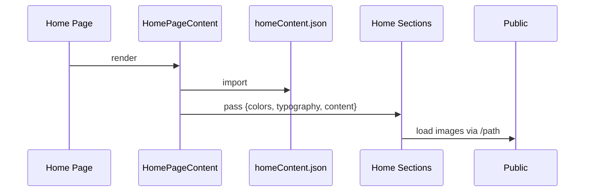
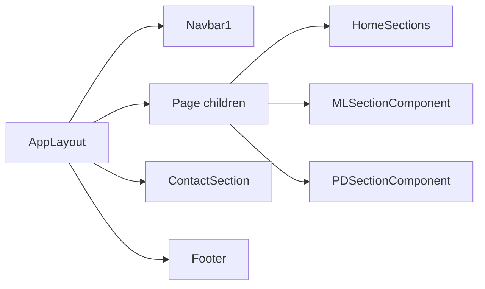

**Overview**
- Next.js App Router with an `AppLayout` shell wraps all pages, ensuring consistent navigation, contact, and footer.
- Data is centralized in `app/data/homeContent.json`, `app/data/mlProjects.ts`, and `app/data/productDesignProjects.ts` and passed into presentational components.
- Dynamic project pages are statically generated using `generateStaticParams`; slugs must exist in the data files.

**Frontend Structure**
- Layout shell: `app/components/AppLayout.tsx` renders `Navbar1`, page `children`, `ContactSection`, and `Footer`.
- Navbar: `components/navbar1.tsx` used by `AppLayout`.
- Footer: `app/components/home/Footer.tsx` included globally.
- Contact: `app/components/ContactSection.tsx` included globally with content from `homeContent.json`.
- Home page: `app/page.tsx` renders `HomePageContent` which orchestrates sections from `homeContent.json`.
- ML project page: `app/ml/[slug]/page.tsx` selects a section component by `slug` and renders ML content.
- PD project page: `app/product-design/[slug]/page.tsx` selects a section component by `slug` and renders PD content.
- Section components:
  - ML sections: `app/components/projects/ml-sections/*` (e.g., `RagEvaluationSystem.tsx`, `FraudDetectionSystem.tsx`, `RealTimeMeetingAgent.tsx` plus shared ML section blocks).
  - PD sections: `app/components/projects/pd-sections/*` (e.g., `tide.tsx`, `telenor.tsx`, `epam.tsx`, `mentormate.tsx` plus shared PD section blocks).

**Data Management**
- Core files:
  - `app/data/homeContent.json` for Home content, colors, typography, and preview lists.
  - `app/data/mlProjects.ts` for ML projects with `slug`, `title`, `heroImage`, and `sections`.
  - `app/data/productDesignProjects.ts` for PD projects with `slug`, `heroTitle`, and `sections`.
- All text, image paths, and SVG references live in these data files; components are presentational and consume props only.
- Static assets are stored under `public/` and referenced via root-relative paths like `/rag-hero.png`.
- Utilities:
  - `app/utils/projectUtils.ts` provides `getMLProjects`, `getProductDesignProjects`, and `getProjectBySlug` for unified retrieval.

**Project Creation Process**
- Create a section component:
  - ML: add `app/components/projects/ml-sections/<project-name>.tsx`.
  - PD: add `app/components/projects/pd-sections/<project-name>.tsx`.
- Add project data:
  - ML: append a new object with a unique `slug` to `app/data/mlProjects.ts`.
  - PD: append a new object with a unique `slug` to `app/data/productDesignProjects.ts`.
- Wire up routing:
  - ML route: update `switch (slug)` in `app/ml/[slug]/page.tsx` to import and return the new component.
  - PD route: update `switch (slug)` in `app/product-design/[slug]/page.tsx` similarly.
- Surface on Home:
  - Update `mlPreview.projects` or `pdPreview.projects` in `app/data/homeContent.json` to include the new project card.
- Assets:
  - Place images/SVGs/GIFs under `public/` and reference them via `/your-asset.ext`. Never embed inline file content in components.
- Use existing projects as templates; mirror the JSON/TS schema to ensure expected props are present.

**Style Guidelines**
- Spacing: leverage shared layout primitives in `app/components/ui/Layout.tsx` (`Container`, `Section`, `Grid`, `Flex`, `TwoColumn`).
- Heading sizes: follow `typography` scales in `homeContent.json` (hero, services, features, mlPreview, pdPreview, about).
- Color scheme: consume `colors` from `homeContent.json` (primary, secondary, background, text, border) rather than hardcoding.
- Component layouts: prefer shared UI components (`Typography.tsx`, `ImageGallery.tsx`, `AchievementList.tsx`, `GradientBackground.tsx`).
- Never hardcode text or image paths in section components; always pass from data.

**Improvement Process**
- Analyze current implementation and dependencies before changes:
  - Identify where data enters a page and how it flows through sections.
  - Confirm the `slug` exists in the relevant data file before wiring routes.
- Plan modifications to avoid breaking static generation:
  - `dynamicParams=false` requires that all slugs are enumerated by `generateStaticParams`.
- Maintain data-first architecture:
  - Move any ad hoc text, icons, and images into the appropriate data file.

**Visual Diagrams**
```mermaid
flowchart TD
  A[Request /] --> B[RootLayout app/layout.tsx]
  A2[Request /ml/:slug] --> B
  A3[Request /product-design/:slug] --> B
  B --> C[AppLayout app/components/AppLayout.tsx]
  C --> D{Route}
  D --> E[Home app/page.tsx]
  D --> F[ML app/ml/[slug]/page.tsx]
  D --> G[PD app/product-design/[slug]/page.tsx]
  C --> H[ContactSection]
  C --> I[Footer]
```





**File Structure**
- `app/`: Next.js App Router root; `layout.tsx`, `page.tsx`, route segments.
- `app/components/`: App shell and reusable modules.
- `app/components/home/`: Home sections: `HeroSection.tsx`, `ServicesSection.tsx`, `FeaturesSection.tsx`, `MLPreviewSection.tsx`, `PDPreviewSection.tsx`, `AboutSection.tsx`, `Footer.tsx`.
- `app/components/projects/ml-sections/`: ML project section components (detail views and shared blocks).
- `app/components/projects/pd-sections/`: PD project section components (detail views and shared blocks).
- `app/components/ui/`: Shared UI primitives (`Layout.tsx`, `Typography.tsx`, `ImageGallery.tsx`, `AchievementList.tsx`, `GradientBackground.tsx`).
- `app/data/`: Content sources (`homeContent.json`, `mlProjects.ts`, `productDesignProjects.ts`, `styles.json`).
- `app/utils/`: Retrieval helpers (`projectUtils.ts`).
- `public/`: Static assets referenced by root-relative paths.
- `types/`: Project and content types.

**Code References**
- `app/utils/projectUtils.ts:6` `getAllProjects`
- `app/utils/projectUtils.ts:10` `getProjectBySlug`
- `app/utils/projectUtils.ts:15` `getMLProjects`
- `app/utils/projectUtils.ts:19` `getProductDesignProjects`
- `app/utils/projectUtils.ts:23` `getMLProjectFromHomeContent`
- `app/ml/[slug]/page.tsx:9` `generateStaticParams`
- `app/ml/[slug]/page.tsx:22` `MLProjectPage`
- `app/ml/[slug]/page.tsx:44` `dynamicParams=false`
- `app/product-design/[slug]/page.tsx:9` `generateStaticParams`
- `app/product-design/[slug]/page.tsx:21` `ProductDesignProjectPage`
- `app/product-design/[slug]/page.tsx:46` `dynamicParams=false`
- `app/components/AppLayout.tsx:28` `ContactSection` usage
- `app/components/AppLayout.tsx:31` `Footer` usage
- `app/page.tsx:1` `HomePageContent` import
- `app/components/HomePageContent.tsx:3` `homeContent.json` import and section orchestration

**Adding A New Project (Example)**
- ML Example (`slug`: `smart-retriever`):
  - Add section component `app/components/projects/ml-sections/SmartRetriever.tsx`.
  - Append project to `app/data/mlProjects.ts` with `slug: "smart-retriever"` and `sections`.
  - In `app/ml/[slug]/page.tsx`, import `SmartRetriever` and add a `case 'smart-retriever'` returning the component.
  - Add a preview card to `mlPreview.projects` in `homeContent.json`.
- PD Example (`slug`: `design-system`):
  - Add section component `app/components/projects/pd-sections/DesignSystem.tsx`.
  - Append project to `app/data/productDesignProjects.ts`.
  - In `app/product-design/[slug]/page.tsx`, import and add a `case 'design-system'`.
  - Add a preview card to `pdPreview.projects` in `homeContent.json`.

**Maintaining Style Consistency**
- Use `colors` and `typography` from `homeContent.json` consistently.
- Use `Layout` primitives to standardize spacing and structure across sections.
- Keep section components presentational; push content and assets to data files.
- Reference assets via `/...` paths from `public/` only.
